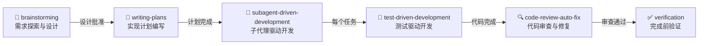

<div align="center">

# 🧠 AI Skills & Rules

**可插拔的 AI 增强插件 — 为任何 AI 编码助手注入工作流纪律、代码质量保障和自进化规则体系**

[](LICENSE)
[](#支持的-ai-工具)
[](#安装)

</div>

---

> **一句话介绍**：克隆本仓库 → 运行安装脚本 → 你的 AI 编码助手立刻获得完整的开发工作流纪律、15 个增强 Skill 和自进化规则体系。

## ✨ 核心特性

- 🔌 **即插即用** — 一键安装到任何项目，AI 工具自动加载，零配置
- 🔗 **工作流闭环** — 从需求探索到完成验证的完整开发链路，每个环节都是门禁
- 🛡️ **对抗性设计** — 内置代码质量自检、双层审查体系，防止 AI 偷懒或跳步
- 🧬 **自进化规则** — AI 自动捕捉不足并生成规则，规则体系越用越强
- 📦 **15 个增强 Skill** — 覆盖元能力、工作流、工具三层，按需加载
- 🌐 **多平台原生支持** — Claude Code、Cursor、Gemini CLI、CodeBuddy、Trae、通用 Agent 一站式覆盖
- 🖥️ **跨操作系统** — macOS、Linux、Windows 全平台安装脚本

## 🚀 快速开始

### 1. 克隆仓库

```bash
cd /path/to/your/projects
git clone https://github.com/kozeelab/ai-skills-and-rules.git
```

### 2. 安装到目标项目

<details>
<summary><b>macOS / Linux</b></summary>

```bash
# 交互式安装（选择需要的入口文件）
./install.sh ~/projects/my-app

# 全部安装
./install.sh --all ~/projects/my-app

# 查看安装状态
./install.sh --status ~/projects/my-app

# 卸载
./install.sh --uninstall ~/projects/my-app
```

</details>

<details>
<summary><b>Windows (PowerShell)</b></summary>

```powershell
# 交互式安装
.\install.ps1 C:\Projects\my-app

# 全部安装
.\install.ps1 -All C:\Projects\my-app

# 查看安装状态
.\install.ps1 -Status C:\Projects\my-app

# 卸载
.\install.ps1 -Uninstall C:\Projects\my-app
```

> ⚠️ Windows 创建符号链接需要**管理员权限**或已开启**开发者模式**。

</details>

### 3. 其他配置方式

#### 手动符号链接

如果不想使用安装脚本，也可以手动创建符号链接：

```bash
# macOS / Linux
cd ~/projects/my-app
ln -s ../ai-skills-and-rules/CLAUDE.md CLAUDE.md
ln -s ../ai-skills-and-rules/.cursorrules .cursorrules
ln -s ../ai-skills-and-rules/AGENTS.md AGENTS.md
```

```powershell
# Windows (管理员 PowerShell)
cd C:\Projects\my-app
New-Item -ItemType SymbolicLink -Path CLAUDE.md -Target ..\ai-skills-and-rules\CLAUDE.md
New-Item -ItemType SymbolicLink -Path .cursorrules -Target ..\ai-skills-and-rules\.cursorrules
New-Item -ItemType SymbolicLink -Path AGENTS.md -Target ..\ai-skills-and-rules\AGENTS.md
```

#### Custom Instructions（自定义指令）

如果你的 AI 工具不支持自动加载入口文件，可以在自定义指令（Custom Instructions / User Rules）中添加：

```
每次开启全新对话时，你必须首先执行以下操作：
1. 读取项目平级目录下的 ai-skills-and-rules 仓库
2. 遵守 rules/ 目录下的所有规则
3. 当需要使用 skill 时，优先查看 skills/index.md 索引匹配合适的 Skill
```

### 4. 一键冷启动

在 AI 对话中发送：

```
#start
```

AI 会自动加载所有规则 + 激活所有自动化 Skill + 输出就绪状态报告。

## 📋 支持的 AI 工具

安装脚本会将以下入口文件符号链接到你的项目中，对应工具自动识别并加载：

| AI 工具 | 入口文件 | 加载方式 |
|---------|---------|----------|
| **Claude Code** | `CLAUDE.md` | 自动读取项目根目录 |
| **Gemini CLI** | `GEMINI.md` + `gemini-extension.json` | 通过 extension.json 注册 |
| **Cursor** | `.cursorrules` | 自动读取项目级规则 |
| **Cursor Agent** | `AGENTS.md` | Agent 模式自动读取 |
| **CodeBuddy** | `.codebuddy/rules/main.md` | 自动读取 .codebuddy/rules/ 目录 |
| **Trae** | `.trae/rules/main.md` | 自动读取 .trae/rules/ 目录 |
| **通用 Agent** | `AGENTS.md` | 作为 Agent 指令入口 |

> 💡 不在列表中的工具？可以通过 Custom Instructions 手动配置，详见下方[其他配置方式](#其他配置方式)。

## 🏗️ 仓库架构

```
ai-skills-and-rules/
├── install.sh                ← 安装脚本 (macOS / Linux)
├── install.ps1               ← 安装脚本 (Windows PowerShell)
├── CLAUDE.md                 ← Claude Code 入口
├── GEMINI.md                 ← Gemini CLI 入口
├── gemini-extension.json     ← Gemini CLI 插件注册
├── .codebuddy/               ← CodeBuddy 入口
│   └── rules/main.md         ← CodeBuddy 自动加载规则
├── .trae/                    ← Trae 入口
│   └── rules/main.md         ← Trae 自动加载规则
├── AGENTS.md                 ← Cursor Agent / 通用 Agent 入口
├── .cursorrules              ← Cursor 入口
│
├── rules/                    ← 📏 规则体系（AI 行为约束）
│   ├── index.md              ← 规则索引
│   ├── common/               ← 通用规则（所有项目适用）
│   │   ├── rule.md           ← 核心协作开发规范
│   │   ├── api-design.md     ← API 设计规范
│   │   ├── error-handling.md ← 错误处理规范
│   │   └── database.md       ← 数据库操作规范
│   └── languages/            ← 语言特定规则
│       └── go/code-style.md  ← Go 编码风格
│
└── skills/                   ← 🧠 Skill 体系（AI 能力增强）
    ├── index.md              ← Skill 索引（含工作流编排）
    ├── meta/                 ← 📦 元能力层（AI 自我进化）
    │   ├── skill-auto-activator.md
    │   ├── ai-rule-generator.md
    │   ├── skill-quality-guardian.md
    │   ├── prompt-optimizer.md
    │   └── skill-creator.md
    ├── workflow/             ← 🔗 工作流层（开发流程纪律）
    │   ├── brainstorming/
    │   ├── writing-plans/
    │   ├── test-driven-development/
    │   ├── systematic-debugging/
    │   ├── verification-before-completion/
    │   └── subagent-driven-development/
    └── tools/                ← 🧰 工具层（实用工具）
        ├── code-review-auto-fix.md
        ├── project-summary.md
        ├── git-multi-env.md
        └── awesome-design.md
```

## 🧠 Skill 体系

### 📦 元能力层 — 让 AI 自我进化

| Skill | 说明 |
|-------|------|
| **Skill 自动激活守护器** | `#start` 一键冷启动，加载规则 + 激活 Skill |
| **AI 不足捕捉与规则生成器** | 自动捕捉 AI 不足，生成规则，越用越强 |
| **Skill 质量守护者** | 学习最新 AI 知识，9 维度审查和完善 Skill |
| **提示词自动优化器** | 自动拦截并优化用户提示词 |
| **Skill 创建器** | 标准化 Skill 创建流程 |

### 🔗 工作流层 — 开发流程纪律



| 用户意图 | 触发的工作流 | 起始 Skill |
|---------|------------|------------|
| 新功能 / 新项目 | 完整开发工作流 | brainstorming |
| Bug 修复 | Bug 修复工作流 | systematic-debugging |
| 简单代码修改 | 无需工作流 | 直接执行 |
| 重构 | 完整开发工作流（简化版） | brainstorming |

### 🧰 工具层 — 实用工具

| Skill | 说明 |
|-------|------|
| **代码自动审查与修复器** | 双层审查体系（项目规范 + 软件工程最佳实践），自动修复 |
| **项目总结** | 高质量简历项目经历生成 |
| **Git 多环境隔离** | SSH Key 多环境隔离配置 |
| **Awesome Design** | 60+ 知名品牌设计系统一键引入 |

## 📏 规则体系

规则是 AI 必须遵守的行为约束，确保代码质量和协作纪律：

| 规则 | 说明 |
|------|------|
| **AI 协作开发规范** | 任务执行流程、架构约束、上下文管理、代码质量自检 |
| **API 设计规范** | RESTful API 设计、路由管理 |
| **错误处理规范** | 错误分类、传递、记录 |
| **数据库操作规范** | 事务管理、查询优化 |
| **Go 代码风格** | Go 语言编码风格（按需加载） |

> 规则体系支持自进化：AI 在协作中自动捕捉不足并生成新规则。

## 🎯 与 obra/superpowers 的对比

| 维度 | obra/superpowers | 本仓库 |
|------|-----------------|--------|
| 工作流闭环 | ✅ | ✅ |
| 对抗性设计 | ✅ | ✅ |
| 元数据规范 | ❌ 极简 | ✅ 完整 YAML |
| 索引管理 | ❌ | ✅ 动态索引 |
| 规则自进化 | ❌ | ✅ |
| Skill 质量保障 | ❌ | ✅ |
| 一键冷启动 | ❌ | ✅ |
| 提示词优化 | ❌ | ✅ |
| 中文支持 | ❌ | ✅ |
| 插件化使用 | ⚠️ 需配置 | ✅ 即插即用 |
| 跨平台安装脚本 | ❌ | ✅ macOS/Linux/Windows |

## 🔧 自定义与扩展

### 添加项目特定规则

```bash
# 添加通用规则
echo "# 你的规则" > rules/common/your-rule.md

# 添加语言特定规则
mkdir -p rules/languages/python
echo "# Python 规则" > rules/languages/python/code-style.md
```

### 创建自定义 Skill

使用内置的 Skill 创建器：

```
帮我创建一个 Skill，用于 [你的需求]
```

或手动创建：
- **简单 Skill**：`skills/<层>/your-skill.md`（层 = `meta` / `workflow` / `tools`）
- **复杂 Skill**：`skills/<层>/your-skill/SKILL.md` + 附属文件

### 关闭不需要的功能

```
#start --exclude=prompt-optimizer,skill-quality-guardian
```

## 📖 更多文档

- [rules/index.md](rules/index.md) — 规则索引
- [skills/index.md](skills/index.md) — Skill 索引与工作流编排

## 📄 许可

[MIT License](LICENSE)
