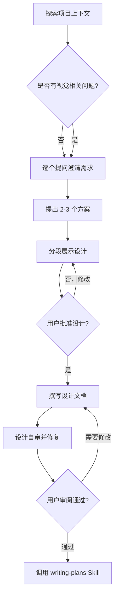

# 需求探索与设计

## 功能说明

> **核心目标**：在任何创造性工作（创建功能、构建组件、添加功能、修改行为）之前，通过协作对话探索用户意图、需求和设计方案。**确保 AI 理解了要做什么，再动手写代码。**

本 Skill 的工作模式是**苏格拉底式对话**——通过提问引导用户澄清需求，而非直接给出方案。

---

## 铁律

<HARD-GATE>
在你展示设计方案并获得用户批准之前，**禁止**调用任何实现类 Skill、编写任何代码、搭建任何项目结构、或采取任何实现行动。
无论项目看起来多简单，此规则都适用。
</HARD-GATE>

```
没有经过设计的代码 = 没有地基的楼房
```

---

## 反模式："这个太简单了，不需要设计"

每个项目都必须经过此流程。一个 TODO 列表、一个单函数工具、一个配置变更——全部都要。

"简单"的项目恰恰是未经审视的假设造成最多浪费的地方。设计可以很短（对于真正简单的项目只需几句话），但你**必须**展示它并获得批准。

---

## 执行清单

你**必须**按顺序完成以下每一项：

1. **探索项目上下文** — 检查文件、文档、最近的提交
2. **逐个提问澄清需求** — 每次只问一个问题，理解目的/约束/成功标准
3. **提出 2-3 个方案** — 附带权衡分析和你的推荐
4. **分段展示设计** — 按复杂度分段展示，每段获得用户确认后再继续
5. **撰写设计文档** — 保存到 `docs/specs/YYYY-MM-DD-<主题>-design.md` 并提交
6. **设计自审** — 快速检查占位符、矛盾、歧义、范围问题
7. **用户审阅文档** — 请用户审阅设计文档后再继续
8. **过渡到实现** — 调用 `writing-plans` Skill 创建实现计划

---

## 流程图



**终态是调用 writing-plans。** 不要调用任何其他实现类 Skill。

---

## 详细流程

### 阶段一：理解想法

- 先检查当前项目状态（文件、文档、最近提交）
- 在深入提问之前，先评估范围：如果需求描述了多个独立子系统（如"构建一个包含聊天、文件存储、计费和分析的平台"），**立即标记**。不要花时间细化一个需要拆分的项目的细节
- 如果项目太大无法用单个设计覆盖，帮助用户拆分为子项目：独立的部分是什么？它们如何关联？应该按什么顺序构建？然后对第一个子项目走正常设计流程
- **每次只问一个问题**，理解：目的、约束、成功标准
- 尽量使用**选择题**，比开放式问题更容易回答
- 聚焦于理解：目的、约束、成功标准

### 阶段二：探索方案

- 提出 2-3 个不同方案，附带权衡分析
- 以对话方式展示选项，给出你的推荐和理由
- **先展示推荐方案**，解释为什么推荐

### 阶段三：展示设计

- 当你认为已经理解了要构建什么，展示设计
- 按复杂度分段展示：简单的几句话，复杂的 200-300 字
- 每段之后询问是否正确
- 覆盖：架构、组件、数据流、错误处理、测试
- 准备好回头澄清不清楚的地方

### 阶段四：设计原则

- 将系统拆分为更小的单元，每个单元有一个明确的目的，通过定义良好的接口通信，可以独立理解和测试
- 对每个单元，你应该能回答：它做什么？怎么用它？它依赖什么？
- 更小、边界清晰的单元也更容易让 AI 处理——你在能一次性放入上下文的代码上推理更好，文件聚焦时编辑更可靠

### 阶段五：在已有代码库中工作

- 在提出变更之前先探索现有结构，遵循现有模式
- 如果现有代码有影响当前工作的问题（如文件过大、边界不清、职责纠缠），将有针对性的改进纳入设计——就像一个好开发者改进他正在工作的代码
- 不要提出无关的重构。聚焦于服务当前目标的改进

---

## 设计完成后

### 文档化

- 将验证通过的设计写入 `docs/specs/YYYY-MM-DD-<主题>-design.md`
  - （用户对设计文档位置的偏好优先于此默认值）
- 提交设计文档到 git

### 设计自审

写完设计文档后，用全新的眼光审视它：

1. **占位符扫描**：有没有"待定"、"TODO"、不完整的章节、模糊的需求？修复它们
2. **内部一致性**：各章节之间有没有矛盾？架构是否与功能描述匹配？
3. **范围检查**：是否足够聚焦，可以用单个实现计划覆盖？还是需要拆分？
4. **歧义检查**：有没有需求可以被两种方式解读？如果有，选一种并明确

发现问题就直接修复，无需重新审阅。

### 用户审阅门禁

设计自审通过后，请用户审阅：

> "设计文档已写入并提交到 `<路径>`。请审阅，如果需要修改请告诉我，我们在开始制定实现计划之前确认设计。"

等待用户回复。如果用户要求修改，修改后重新自审。只有用户批准后才继续。

### 过渡到实现

- 调用 `writing-plans` Skill 创建详细的实现计划
- **不要**调用任何其他 Skill。writing-plans 是下一步

---

## 关键原则

- **每次只问一个问题** — 不要用多个问题轰炸用户
- **优先选择题** — 比开放式问题更容易回答
- **YAGNI 无情执行** — 从所有设计中移除不必要的功能
- **探索替代方案** — 总是提出 2-3 个方案后再确定
- **增量验证** — 展示设计，获得批准后再继续
- **保持灵活** — 当某些东西不合理时，回头澄清

---

## 危险信号 — 立即停下

如果你发现自己在想：

| 想法 | 现实 |
|------|------|
| "这只是个简单问题" | 简单问题也是任务。检查是否需要设计 |
| "我先探索一下代码库" | Skill 告诉你**如何**探索。先走流程 |
| "让我先快速查一下文件" | 文件缺少对话上下文。先走流程 |
| "这不需要正式设计" | 如果 Skill 存在，就使用它 |
| "这个 Skill 太重了" | 简单的事情会变复杂。使用它 |
| "我先做这一件事" | 在做任何事之前先检查 |
| "用户说的很清楚了，不需要再问" | 你以为清楚 ≠ 真的清楚。确认一下 |
| "先写代码，后面再设计" | 这正是此 Skill 要防止的行为 |

**以上所有想法都意味着：停下。回到流程。**

---

## 常见借口反驳表

| 借口 | 现实 |
|------|------|
| "太简单不需要设计" | 简单项目的未审视假设造成最多浪费。设计可以很短，但必须有 |
| "用户很着急" | 系统化设计比返工更快。5 分钟设计省 2 小时返工 |
| "我已经知道怎么做了" | 你知道怎么做 ≠ 用户想要什么。确认需求 |
| "先写个原型" | 原型会变成产品。先设计 |
| "需求很明确" | 你认为明确 ≠ 真的明确。问一个确认问题 |
| "这只是个 bug 修复" | Bug 修复用 systematic-debugging Skill，不是直接改代码 |

---

## 与其他 Skill 的关系

| 关系 | Skill | 说明 |
|------|-------|------|
| **后续** | `writing-plans` | 设计批准后，调用此 Skill 创建实现计划 |
| **互斥** | 所有实现类 Skill | 设计未批准前，禁止调用任何实现类 Skill |
| **协作** | `prompt-optimizer` | 可在 brainstorming 阶段优化用户的需求描述 |

---

## 注意事项

1. **不要跳过设计**：无论项目多简单，都必须经过设计流程
2. **不要过度设计**：设计的深度应与项目复杂度匹配
3. **不要替用户做决定**：展示选项和推荐，让用户选择
4. **不要一次问太多**：每次只问一个问题
5. **不要忽略现有代码**：在已有项目中工作时，先理解现有架构
6. **设计文档是活的**：随着理解深入，设计可以迭代更新
