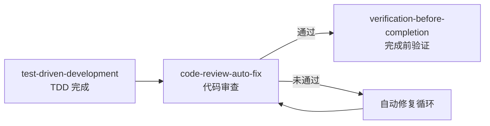

# 代码自动审查与修复器

## 功能说明

> **核心目标**：作为 AI 代码生成流程的**全方位质量关卡**，在 AI 每次生成或修改代码后自动触发审查流程，基于**双层审查体系**（`rules/` 项目规范 + 通用软件工程最佳实践）进行全方位质量检查，发现不合规项后自动修复，循环审查直到代码完全符合所有质量要求，确保交付给用户的代码始终是高质量的。

本 Skill 的工作模式是**质量门禁 + 自动修复引擎**——在 AI 输出代码之前拦截，执行全量审查（项目规范 + 通用最佳实践），不合规则自动修复后重新审查，直到所有检查项通过才放行。

### 核心能力

1. **规范动态加载**：自动读取 `rules/index.md` 发现所有项目规范文件，构建审查规则集
2. **通用最佳实践内置**：内置通用软件工程最佳实践审查标准，不依赖 rules/ 文件即可覆盖核心质量维度
3. **多维度审查**：覆盖架构、安全、错误处理、代码风格、性能、数据库、可维护性、可测试性、设计模式等全部维度
4. **自动修复**：发现问题后自动修改代码，无需用户介入
5. **循环验证**：修复后重新审查，确保修复本身不引入新问题
6. **审查报告**：输出结构化的审查报告，让用户了解代码质量状况

---

## 审查规则集（双层体系）

> **核心设计**：审查标准采用**双层体系**，第一层是 `rules/` 目录下的项目规范（动态加载），第二层是通用软件工程最佳实践（内置标准）。两层互补，确保即使 `rules/` 目录为空或不完整，审查器仍能基于通用最佳实践保障代码质量。

### 第一层：项目规范（来自 rules/ 目录）

AI 必须在每次对话开始时读取 `rules/index.md`，动态构建项目规范审查规则集。项目规范的优先级高于通用最佳实践——当两者冲突时，以项目规范为准。

> 以下为当前已有规则文件与审查维度的映射关系，AI 应动态构建此表。

| 审查维度 | 规则来源 | 审查要点 | 严重级别 |
|---------|---------|---------|----------|
| 架构合规 | `rules/common/rule.md` §二 | 分层正确、依赖方向单向、无越层调用 | 🔴 阻断 |
| 错误处理 | `rules/common/error-handling.md` | 错误分层传递、不吞错误、统一响应、错误码管理 | 🔴 阻断 |
| API 设计 | `rules/common/api-design.md` | RESTful 规范、统一响应格式、参数校验、分页、文档注释 | 🔴 阻断 |
| 数据库操作 | `rules/common/database.md` | 参数化查询、事务管理、N+1 防护、软删除、索引 | 🔴 阻断 |
| 代码风格 | `rules/languages/{lang}/code-style.md` | 命名规范、格式化、注释、控制结构、导入顺序 | 🟡 警告 |
| 数据安全 | `rules/common/rule.md` §四 + `api-design.md` §八 | 无 SQL 拼接、无 XSS、无敏感信息泄露、输入校验 | 🔴 阻断 |
| 边界条件 | `rules/common/rule.md` §四 | 空值处理、超限处理、并发安全 | 🟡 警告 |
| 性能 | `rules/common/rule.md` §四 + `database.md` §四 | 无 N+1、有分页、限制 PageSize | 🟡 警告 |
| 文档注释 | `rules/common/rule.md` §六 + `code-style.md` §三 | 导出符号有注释、Swagger 文档 | 🟡 警告 |
| 日志规范 | `rules/common/rule.md` §四 | 关键操作有日志、无敏感字段 | 🟡 警告 |

### 第二层：通用软件工程最佳实践（内置标准）

> 以下审查维度**不依赖 `rules/` 目录**，是 AI 基于通用软件工程知识内置的审查标准。即使项目没有 `rules/` 目录，这些标准仍然生效。

#### 2.1 SOLID 原则审查

| 原则 | 审查要点 | 严重级别 |
|------|---------|----------|
| 单一职责（SRP） | 一个函数/类/模块只做一件事，函数不超过 80 行，类不超过 800 行 | 🟡 警告 |
| 开闭原则（OCP） | 通过扩展而非修改来增加功能，使用接口/策略模式而非 if-else 堆叠 | 🔵 建议 |
| 里氏替换（LSP） | 子类/实现可以替换父类/接口而不破坏行为 | 🟡 警告 |
| 接口隔离（ISP） | 接口应小而专注，不强迫实现者依赖不需要的方法 | 🔵 建议 |
| 依赖倒置（DIP） | 高层模块不依赖低层模块，都依赖抽象 | 🟡 警告 |

#### 2.2 代码可读性与可维护性审查

```
检查项：
├── [ ] 函数/变量命名是否自解释？（无需注释即可理解意图）
├── [ ] 函数长度是否合理？（建议 ≤ 40 行，最大 ≤ 80 行）
├── [ ] 圈复杂度是否过高？（建议 ≤ 10，最大 ≤ 15）
├── [ ] 是否存在重复代码？（DRY 原则，相同逻辑出现 ≥ 3 次应提取）
├── [ ] 是否存在过长的参数列表？（建议 ≤ 3 个，最大 ≤ 5 个）
├── [ ] 是否存在深层嵌套？（建议 ≤ 3 层，最大 ≤ 4 层）
├── [ ] 布尔参数是否应该拆分为两个函数？
├── [ ] 是否存在「上帝对象」？（一个类/结构体承担过多职责）
├── [ ] 代码是否遵循「最少惊讶原则」？（行为符合直觉预期）
└── [ ] 是否有 TODO/FIXME/HACK 等技术债务标记未处理？
```

#### 2.3 设计模式与反模式审查

**应鼓励的模式**：

| 场景 | 推荐模式 | 审查要点 |
|------|---------|----------|
| 对象创建复杂 | 工厂模式/建造者模式 | 是否直接 new 了复杂对象 |
| 多种算法/策略切换 | 策略模式 | 是否用 if-else/switch 堆叠了多种策略 |
| 跨层解耦 | 依赖注入 | 是否在函数内部直接创建依赖 |
| 事件通知 | 观察者/发布订阅 | 是否用硬编码调用链实现通知 |
| 资源管理 | 资源池/单例 | 是否频繁创建销毁昂贵资源 |

**应避免的反模式**：

| 反模式 | 检测方式 | 严重级别 |
|--------|---------|----------|
| 上帝类/上帝函数 | 单个类/函数职责过多，代码行数过长 | 🟡 警告 |
| 意大利面条代码 | 控制流混乱，goto/深层嵌套/多重 break | 🟡 警告 |
| 金锤子 | 所有问题都用同一种方案解决 | 🔵 建议 |
| 魔法数字/魔法字符串 | 代码中直接使用未命名的字面量 | 🟡 警告 |
| 过早优化 | 在没有性能数据支撑的情况下做复杂优化 | 🔵 建议 |
| 复制粘贴编程 | 大段重复代码 | 🟡 警告 |
| 循环依赖 | 模块 A 依赖 B，B 又依赖 A | 🔴 阻断 |
| 硬编码配置 | 将环境相关的值硬编码在代码中 | 🔴 阻断 |

#### 2.4 可测试性审查

```
检查项：
├── [ ] 函数是否可以独立测试？（无隐式全局状态依赖）
├── [ ] 外部依赖是否通过接口注入？（可 mock/stub）
├── [ ] 是否存在不可测试的私有逻辑？（复杂逻辑应可独立测试）
├── [ ] 函数是否有明确的输入输出？（纯函数优先）
├── [ ] 副作用是否被隔离？（IO/网络/数据库操作与业务逻辑分离）
├── [ ] 是否存在时间依赖？（使用可注入的时间源而非 time.Now()）
└── [ ] 是否存在随机性依赖？（使用可注入的随机源）
```

#### 2.5 并发安全审查

```
检查项：
├── [ ] 共享可变状态是否有同步保护？（mutex/channel/atomic）
├── [ ] 是否存在竞态条件？（check-then-act 模式）
├── [ ] goroutine/线程是否有泄漏风险？（是否有退出机制）
├── [ ] channel 是否可能死锁？（发送和接收是否匹配）
├── [ ] context 是否正确传递和取消？
├── [ ] 是否存在不安全的并发 map 访问？
└── [ ] 资源池/连接池是否线程安全？
```

#### 2.6 健壮性与容错审查

```
检查项：
├── [ ] 外部调用（HTTP/RPC/DB）是否有超时设置？
├── [ ] 外部调用是否有重试机制？（含退避策略）
├── [ ] 是否有熔断/降级机制？（对不可靠的外部依赖）
├── [ ] panic/异常是否被 recover/catch？（不应导致进程崩溃）
├── [ ] 资源是否在所有路径上都被释放？（文件句柄/连接/锁）
├── [ ] 是否处理了网络分区/超时/部分失败等分布式场景？
├── [ ] 配置是否有合理的默认值？（缺失配置不应导致崩溃）
└── [ ] 是否有优雅关闭机制？（信号处理、资源清理）
```

#### 2.7 安全纵深审查（超越基础安全）

```
检查项：
├── [ ] 是否存在不安全的反序列化？
├── [ ] 是否存在 SSRF 风险？（服务端请求伪造）
├── [ ] 是否存在路径遍历风险？（../../../etc/passwd）
├── [ ] 是否存在命令注入风险？（exec/system 调用）
├── [ ] 是否存在不安全的随机数生成？（密码学场景使用 crypto/rand）
├── [ ] 是否存在信息泄露？（stack trace/内部路径/版本号暴露给客户端）
├── [ ] 是否存在不安全的 HTTP 头配置？（CORS/CSP/HSTS）
├── [ ] 认证/授权是否在每个需要保护的端点都生效？
├── [ ] 是否存在 IDOR 漏洞？（通过修改 ID 访问他人资源）
└── [ ] 密码/Token 是否使用了安全的哈希/加密算法？
```

#### 2.8 性能深度审查（超越基础性能）

```
检查项：
├── [ ] 是否存在内存泄漏风险？（未释放的引用/闭包捕获）
├── [ ] 是否存在不必要的内存分配？（对象复用/sync.Pool）
├── [ ] 字符串拼接是否高效？（大量拼接应使用 Builder/Buffer）
├── [ ] 是否存在不必要的序列化/反序列化？
├── [ ] 缓存策略是否合理？（热点数据是否缓存、缓存是否有过期机制）
├── [ ] 是否存在不必要的同步阻塞？（可以异步化的操作）
├── [ ] 批量操作是否使用了批处理？（而非逐条处理）
├── [ ] 是否存在慢查询风险？（缺少索引/全表扫描/大表 JOIN）
└── [ ] 是否考虑了数据量增长后的性能退化？（算法复杂度）
```

#### 2.9 API 契约与兼容性审查

```
检查项：
├── [ ] API 变更是否向后兼容？（不破坏现有客户端）
├── [ ] 是否遵循了语义化版本控制？（破坏性变更需要主版本号升级）
├── [ ] 新增字段是否有默认值？（旧客户端不传不应报错）
├── [ ] 废弃的 API 是否标记了 deprecated？
├── [ ] 响应结构是否稳定？（不随意变更字段名/类型）
├── [ ] 是否有 API 版本管理策略？
└── [ ] 错误码是否稳定且有文档？
```

#### 2.10 配置与环境管理审查

```
检查项：
├── [ ] 配置是否与代码分离？（12-Factor App 原则）
├── [ ] 敏感配置是否通过环境变量/密钥管理服务获取？
├── [ ] 是否有配置校验？（启动时校验必要配置是否存在且合法）
├── [ ] 不同环境（dev/staging/prod）的配置是否隔离？
├── [ ] 是否有配置热更新机制？（如需要）
└── [ ] 默认配置是否安全？（不应默认开启 debug/关闭认证）
```

#### 2.11 日志与可观测性审查

```
检查项：
├── [ ] 关键业务操作是否有日志？（创建/更新/删除/登录等）
├── [ ] 日志级别是否合理？（ERROR/WARN/INFO/DEBUG 分级正确）
├── [ ] 日志是否包含足够的上下文？（请求 ID/用户 ID/操作类型）
├── [ ] 日志是否结构化？（JSON 格式便于检索）
├── [ ] 是否有链路追踪支持？（trace ID 贯穿请求链路）
├── [ ] 是否有关键指标埋点？（请求量/延迟/错误率）
├── [ ] 日志是否避免了敏感信息？（密码/Token/身份证号等）
└── [ ] 是否有健康检查端点？（/health 或 /readiness）
```

#### 2.12 代码整洁度审查

```
检查项：
├── [ ] 是否有未使用的变量/导入/函数？
├── [ ] 是否有注释掉的代码？（应删除，由 git 管理历史）
├── [ ] 是否有过时的注释？（注释与代码不一致）
├── [ ] 是否有空的 catch/except/recover 块？
├── [ ] 是否有不必要的类型转换？
├── [ ] 是否有冗余的条件判断？（如 if x == true）
├── [ ] 文件组织是否合理？（相关代码是否在一起）
└── [ ] 是否遵循了项目的目录结构约定？
```

### 严重级别说明

| 级别 | 标识 | 含义 | 处理方式 |
|------|------|------|----------|
| 🔴 阻断（Blocker） | `BLOCKER` | 必须修复，否则代码不可交付 | 自动修复，修复失败则阻止输出 |
| 🟡 警告（Warning） | `WARNING` | 应当修复，影响代码质量 | 自动修复，修复失败则标注警告 |
| 🔵 建议（Info） | `INFO` | 可以改进，属于最佳实践 | 仅在详细模式下报告 |

### 双层规则的优先级与冲突解决

```
优先级（从高到低）：
1. 项目现有代码风格（一致性最优先）
2. rules/ 目录下的项目规范（第一层）
3. 通用软件工程最佳实践（第二层）

冲突解决策略：
├── 项目规范 vs 通用实践 → 以项目规范为准
├── 项目规范内部冲突 → 以更具体的规则为准
├── 通用实践内部冲突 → 以更高严重级别为准
└── 无明确规则覆盖 → 以通用实践为准
```

---

## AI 执行流程

### Step 1：构建审查规则集（对话开始时执行一次）

```
🔧 构建审查规则集（双层体系）
━━━━━━━━━━━━━━━━━━━━━━━━━━━━
第一层：项目规范
  1. 读取 rules/index.md
  2. 遍历所有规则文件
  3. 提取每个规则文件中的审查要点
  4. 按维度分类，构建项目规范审查清单
  5. 根据项目语言加载语言特定规则

第二层：通用最佳实践
  6. 激活内置的 SOLID 原则审查
  7. 激活内置的可读性/可维护性审查
  8. 激活内置的设计模式/反模式审查
  9. 激活内置的可测试性审查
  10. 激活内置的并发安全审查
  11. 激活内置的健壮性/容错审查
  12. 激活内置的安全纵深审查
  13. 激活内置的性能深度审查
  14. 激活内置的 API 契约/兼容性审查
  15. 激活内置的配置/环境管理审查
  16. 激活内置的日志/可观测性审查
  17. 激活内置的代码整洁度审查

合并：去重 + 冲突解决 → 最终审查清单
━━━━━━━━━━━━━━━━━━━━━━━━━━━━
```

**第一层规则加载优先级**：
1. `rules/common/rule.md` — 核心规则（必须加载）
2. `rules/common/error-handling.md` — 错误处理（必须加载）
3. `rules/common/api-design.md` — API 设计（涉及 API 时加载）
4. `rules/common/database.md` — 数据库操作（涉及数据库时加载）
5. `rules/languages/{lang}/code-style.md` — 语言风格（按项目语言加载）
6. 其他新增规则文件 — 动态发现并加载

**第二层按代码类型自动激活**：
- 所有代码：SOLID 原则 + 可读性 + 设计模式 + 代码整洁度
- 业务逻辑代码：可测试性 + 健壮性
- 并发代码：并发安全
- API 代码：API 契约 + 安全纵深 + 日志可观测性
- 基础设施代码：配置管理 + 性能深度

### Step 2：拦截 AI 生成的代码

当 AI 完成代码生成/修改后，在输出给用户之前，触发审查流程：

```
AI 生成代码
    ↓
[code-review-auto-fix 拦截]
    ↓
提取本轮所有代码变更
    ↓
识别代码类型和涉及的维度
    ↓
进入审查循环
```

**代码类型识别**：

| 代码类型 | 第一层（项目规范） | 第二层（通用最佳实践） |
|---------|-------------------|---------------------|
| API Handler/Controller | 架构合规 + API 设计 + 错误处理 + 数据安全 + 文档注释 | SOLID + 安全纵深 + API 契约 + 日志可观测性 + 健壮性 |
| Service/业务逻辑层 | 架构合规 + 错误处理 + 边界条件 + 日志规范 | SOLID + 可测试性 + 可读性 + 设计模式 + 健壮性 |
| Model/数据访问层 | 数据库操作 + 数据安全 + 错误处理 | 性能深度 + 并发安全 + 可测试性 |
| DTO/Entity 定义 | 代码风格 + 文档注释 | 可读性 + API 契约（向后兼容） |
| 工具函数/通用代码 | 代码风格 + 错误处理 + 边界条件 | SOLID + 可测试性 + 可读性 + 代码整洁度 |
| 配置/脚本 | 数据安全（无硬编码密钥） | 配置管理 + 环境隔离 |
| 中间件/拦截器 | 架构合规 + 错误处理 | 并发安全 + 健壮性 + 日志可观测性 |
| 并发/异步代码 | 错误处理 + 边界条件 | 并发安全 + 健壮性 + 性能深度 |

### Step 3：执行多维度审查

对每个代码变更，按维度逐项审查：

#### 3.1 架构合规审查

```
检查项：
├── [ ] 代码是否放在正确的层级？（Handler/Service/Model/DTO）
├── [ ] 依赖方向是否正确？（上层 → 下层，无逆向依赖）
├── [ ] 是否存在越层调用？（如 Handler 直接调用 Model）
├── [ ] 是否使用了统一响应函数？（禁止直接拼装响应体）
└── [ ] 新增 API 是否有 Swagger 文档注释？
```

#### 3.2 错误处理审查

```
检查项：
├── [ ] 所有错误是否都被处理？（无 _ 忽略错误）
├── [ ] 错误是否分层传递？（无吞掉错误）
├── [ ] 错误信息是否包含上下文？（使用 fmt.Errorf %w 包装）
├── [ ] HTTP 状态码是否正确？（400/404/500 分类）
├── [ ] 错误响应是否使用统一格式？
└── [ ] 错误信息是否暴露了内部细节？
```

#### 3.3 数据安全审查

```
检查项：
├── [ ] 是否存在 SQL 拼接？（必须参数化查询）
├── [ ] 用户输入是否有校验？（长度/格式/范围）
├── [ ] 是否存在 XSS 风险？（输出是否转义）
├── [ ] 敏感信息是否出现在日志/响应中？
├── [ ] 密钥/Token 是否硬编码？
└── [ ] 是否有注入风险？（SQL/命令/路径注入）
```

#### 3.4 代码风格审查

```
检查项（以 Go 为例，其他语言按对应规则文件）：
├── [ ] 命名是否符合规范？（驼峰、接收器命名、包名）
├── [ ] 导入是否分组排序？（标准库 → 第三方 → 内部）
├── [ ] 导出符号是否有文档注释？
├── [ ] 函数参数是否 ≤ 4 个？
├── [ ] 嵌套深度是否 ≤ 4 层？
├── [ ] 是否有魔法数字？
├── [ ] 常量是否使用枚举类型？
├── [ ] 控制结构是否符合规范？（尽早返回、switch 有 default）
└── [ ] 是否有注释掉的代码？
```

#### 3.5 数据库操作审查

```
检查项：
├── [ ] 是否使用参数化查询？（禁止 SQL 拼接）
├── [ ] 多表操作是否使用事务？
├── [ ] 是否存在 N+1 查询？
├── [ ] 列表查询是否有分页？（限制最大 PageSize）
├── [ ] 是否使用软删除？
├── [ ] 连接是否正确关闭？（defer）
└── [ ] 删主表是否清理关联数据？
```

#### 3.6 边界条件审查

```
检查项：
├── [ ] 空值/nil 是否处理？
├── [ ] 空数组/空字符串是否处理？
├── [ ] 超长字符串是否有限制？
├── [ ] 超大分页是否有限制？
├── [ ] 并发场景是否安全？
└── [ ] Create 时是否设了必要默认值？
```

#### 3.7 性能审查

```
检查项：
├── [ ] 是否存在 N+1 查询？
├── [ ] 大数据量是否有分页？
├── [ ] 是否有不必要的全表扫描？
├── [ ] 循环内是否有数据库/网络调用？
└── [ ] 是否有可以批量处理但逐条处理的场景？
```

#### 3.8 通用最佳实践审查（第二层）

> 以下审查项来自内置的通用软件工程最佳实践，按代码类型自动激活对应维度。详细检查项见上方「第二层：通用软件工程最佳实践」章节。

```
通用最佳实践审查维度：
├── [ ] SOLID 原则（SRP/OCP/LSP/ISP/DIP）
├── [ ] 可读性与可维护性（命名/长度/复杂度/DRY）
├── [ ] 设计模式与反模式（鼓励好模式/检测反模式）
├── [ ] 可测试性（依赖注入/纯函数/副作用隔离）
├── [ ] 并发安全（竞态/死锁/泄漏/同步保护）
├── [ ] 健壮性与容错（超时/重试/熔断/优雅关闭）
├── [ ] 安全纵深（SSRF/路径遍历/命令注入/IDOR）
├── [ ] 性能深度（内存泄漏/缓存策略/算法复杂度）
├── [ ] API 契约与兼容性（向后兼容/版本管理/废弃标记）
├── [ ] 配置与环境管理（配置分离/校验/安全默认值）
├── [ ] 日志与可观测性（结构化日志/链路追踪/指标埋点）
└── [ ] 代码整洁度（未使用代码/过时注释/冗余逻辑）
```

### Step 4：生成审查报告

审查完成后，生成结构化的审查报告：

```
🔍 代码审查报告（第 {N} 轮）
━━━━━━━━━━━━━━━━━━━━━━━━━━━━
📁 审查文件：{file_list}
📏 审查规则：{loaded_rules_count} 条（来自 {rule_files_count} 个规则文件）

🔴 阻断项（必须修复）：{blocker_count}
  1. [{维度}] {问题描述}
     📍 位置：{file}:{line}
     💡 修复方案：{fix_description}

  2. [{维度}] {问题描述}
     📍 位置：{file}:{line}
     💡 修复方案：{fix_description}

🟡 警告项（建议修复）：{warning_count}
  1. [{维度}] {问题描述}
     📍 位置：{file}:{line}
     💡 修复方案：{fix_description}

🔵 建议项：{info_count}
  （详细模式下展示）

━━━━━━━━━━━━━━━━━━━━━━━━━━━━
📊 合规率：{pass_count}/{total_count}（{percentage}%）
🏷️ 状态：{PASS / NEED_FIX / BLOCKED}
```

### Step 5：自动修复循环

当审查发现问题时，进入自动修复循环：

```
┌─────────────────────────────────────────┐
│           自动修复循环                    │
│                                         │
│  审查发现问题                            │
│      ↓                                  │
│  按严重级别排序（🔴 优先）                │
│      ↓                                  │
│  逐项自动修复                            │
│      ↓                                  │
│  重新审查修复后的代码                     │
│      ↓                                  │
│  ┌─ 全部通过 → 输出代码 ✅               │
│  │                                      │
│  ├─ 仍有问题且轮次 < max_fix_rounds      │
│  │   → 继续修复（下一轮）                │
│  │                                      │
│  └─ 达到最大轮次仍有问题                  │
│      → 输出代码 + 标注剩余问题 ⚠️        │
└─────────────────────────────────────────┘
```

**修复策略**：

| 问题类型 | 自动修复方式 |
|---------|------------|
| 缺少错误处理 | 添加 `if err != nil` 检查和错误返回 |
| 缺少文档注释 | 根据函数签名和逻辑自动生成注释 |
| SQL 拼接 | 改写为参数化查询 |
| 缺少输入校验 | 添加参数校验逻辑 |
| 命名不规范 | 按规范重命名（驼峰/kebab-case 等） |
| 导入未分组 | 重新排列导入顺序 |
| 魔法数字 | 提取为命名常量 |
| 缺少事务 | 包装为事务操作 |
| 缺少分页 | 添加分页参数和限制 |
| 嵌套过深 | 重构为尽早返回模式 |
| 缺少 Swagger 注释 | 根据函数签名生成 Swagger 注释 |
| 敏感信息泄露 | 移除日志/响应中的敏感字段 |
| 未使用统一响应 | 改写为统一响应函数调用 |
| 函数过长（SRP） | 拆分为多个职责单一的小函数 |
| 重复代码（DRY） | 提取公共函数/方法 |
| 硬编码依赖（DIP） | 改为接口注入 |
| 缺少超时设置 | 为外部调用添加 context 超时 |
| 缺少资源释放 | 添加 defer close/unlock |
| 并发不安全 | 添加 mutex/channel 保护或改用并发安全数据结构 |
| 缺少配置校验 | 添加启动时配置检查 |
| 缺少链路追踪 | 注入 trace ID 到日志和上下文 |
| API 不兼容变更 | 保留旧字段 + 新增字段，标记 deprecated |
| 不安全的随机数 | 替换为 crypto/rand |
| 路径遍历风险 | 添加路径规范化和白名单校验 |

**修复约束**：
- 每轮修复后必须重新审查，确保修复不引入新问题
- 修复不能改变代码的业务逻辑和功能
- 如果某个问题无法自动修复（如架构层级错误需要大规模重构），标记为「需人工介入」
- 最大修复轮次默认为 3 轮，防止无限循环

### Step 6：输出最终结果

审查通过后，输出最终代码和审查摘要：

#### 全部通过时：

```
✅ 代码审查通过
━━━━━━━━━━━━━━
📊 审查 {total_checks} 项，全部通过
🔄 修复轮次：{fix_rounds}（0 = 一次通过）
📏 应用规则：{rule_files}
```

#### 有修复时：

```
✅ 代码审查通过（经 {fix_rounds} 轮修复）
━━━━━━━━━━━━━━━━━━━━━━━━━━━━━━━━━━━━━
📊 审查 {total_checks} 项，发现 {issue_count} 个问题，已全部修复
🔧 修复记录：
   1. [{维度}] {问题} → {修复方式}
   2. [{维度}] {问题} → {修复方式}
📏 应用规则：{rule_files}
```

#### 达到最大轮次仍有问题时：

```
⚠️ 代码审查部分通过（达到最大修复轮次）
━━━━━━━━━━━━━━━━━━━━━━━━━━━━━━━━━━━━━━━
📊 审查 {total_checks} 项，剩余 {remaining_count} 个问题未修复
🔧 已修复 {fixed_count} 个问题
⚠️ 剩余问题（需人工介入）：
   1. [{维度}] {问题描述} — {原因}
📏 应用规则：{rule_files}
```

---

## 双层审查体系架构

```
┌─────────────────────────────────────────────────────────────┐
│                   code-review-auto-fix                       │
│                                                             │
│  ┌─────────────────────┐    ┌────────────────────────────┐  │
│  │  第一层：项目规范     │    │  第二层：通用最佳实践       │  │
│  │  （动态加载）        │    │  （内置标准）              │  │
│  │                     │    │                            │  │
│  │  rules/             │    │  ✦ SOLID 原则              │  │
│  │  ├── rule.md        │    │  ✦ 可读性/可维护性          │  │
│  │  ├── api-design.md  │    │  ✦ 设计模式/反模式          │  │
│  │  ├── error-handling │    │  ✦ 可测试性                │  │
│  │  ├── database.md    │    │  ✦ 并发安全                │  │
│  │  └── languages/     │    │  ✦ 健壮性/容错             │  │
│  │      └── go/        │    │  ✦ 安全纵深                │  │
│  │          └── ...    │    │  ✦ 性能深度                │  │
│  │                     │    │  ✦ API 契约/兼容性          │  │
│  │  （新增规则自动发现） │    │  ✦ 配置/环境管理           │  │
│  │                     │    │  ✦ 日志/可观测性            │  │
│  │                     │    │  ✦ 代码整洁度              │  │
│  └─────────────────────┘    └────────────────────────────┘  │
│              │                          │                    │
│              └──────────┬───────────────┘                    │
│                         ↓                                    │
│              ┌─────────────────────┐                         │
│              │  合并 + 去重 + 冲突解决 │                       │
│              │  （项目规范优先）      │                       │
│              └──────────┬──────────┘                         │
│                         ↓                                    │
│              ┌─────────────────────┐                         │
│              │  最终审查清单         │                        │
│              └──────────┬──────────┘                         │
│                         ↓                                    │
│              拦截代码 → 逐项审查 → 自动修复 → 循环验证          │
│                         ↓                                    │
│              输出高质量代码 + 审查报告                         │
└─────────────────────────────────────────────────────────────┘
```

**动态扩展**：
- **第一层**：当 `rules/` 目录下新增规则文件时，审查器会在下次构建规则集时自动发现并纳入审查范围
- **第二层**：通用最佳实践随 AI 知识库自动更新，无需手动维护

---

## 铁律

```
不经审查的代码不可交付
```

如果代码没有通过审查流程，你**不能**将它输出给用户。没有"太简单不需要审查"的例外。

---

## 危险信号 — 立即停下

如果你发现自己在想以下任何一条，**停下**——你在自我合理化：

| 想法 | 现实 |
|------|------|
| "这段代码太简单了，不需要审查" | 简单代码也有 bug。审查只需几秒 |
| "我很确定这是对的" | 确信 ≠ 证据。运行审查 |
| "只改了一行，不会有问题" | 一行代码可以引入安全漏洞 |
| "审查太慢了，用户在等" | 交付有 bug 的代码更慢（返工） |
| "这只是个示例/原型" | 示例代码会被复制到生产环境 |
| "Linter 已经检查过了" | Linter 不检查业务逻辑、架构合规、安全纵深 |
| "上次类似的代码通过了" | 上下文不同，规则可能已更新 |
| "用户说不需要审查" | 用户可以用 `#code-review off` 关闭，但你不能自己跳过 |

**以上所有想法都意味着：运行审查。没有例外。**

---

## 常见借口反驳表

| 借口 | 现实 |
|------|------|
| "代码太简单不需要审查" | 简单代码的隐含假设最容易出错。审查可以很快 |
| "审查会拖慢开发速度" | 审查发现的问题比后期调试便宜 10 倍 |
| "我已经自检过了" | 自检有盲区。双层审查体系覆盖你看不到的维度 |
| "这只是修改了格式/注释" | 格式修改可能意外改变逻辑。审查确认无副作用 |
| "用户很着急" | 交付有 bug 的代码 = 更着急的返工 |
| "这段代码是从文档复制的" | 文档代码可能过时、不安全、不符合项目规范 |
| "测试通过了就行" | 测试通过 ≠ 代码质量好。审查检查测试不覆盖的维度 |
| "只是内部工具，不需要那么严格" | 内部工具的安全漏洞是攻击者的最爱 |

---

## 与工作流 Skill 的集成

### 在工作流中的位置



### 与子代理驱动开发的集成

在 `subagent-driven-development` 工作流中，本 Skill 作为**代码质量审查子代理**的审查标准：

1. 实现者子代理完成任务 → 规格合规审查通过
2. **分派代码质量审查子代理** → 基于本 Skill 的双层审查体系进行审查
3. 审查通过 → 标记任务完成
4. 审查未通过 → 实现者修复 → 重新审查

---

## 与其他 Skill 的协作

| 协作 Skill | 协作方式 |
|-----------|---------|
| **prompt-optimizer** | prompt-optimizer 优化用户输入 → AI 生成代码 → **code-review-auto-fix 审查代码** |
| **ai-rule-generator** | 审查器发现的反复出现的新问题 → 通知 ai-rule-generator 生成新规则 → 审查器自动加载新规则 |
| **skill-auto-activator** | 守护器负责激活和监控本 Skill 的运行状态 |
| **test-driven-development** | TDD 确保代码有测试覆盖 → 本 Skill 确保代码质量达标 |
| **verification-before-completion** | 本 Skill 审查通过后 → verification 做最终验证 |
| **subagent-driven-development** | 本 Skill 作为代码质量审查子代理的审查标准 |

```
用户输入
  ↓
[prompt-optimizer] 优化提示词
  ↓
AI 生成代码
  ↓                                    ┌── 第一层：rules/ 项目规范
[code-review-auto-fix] 审查 + 自动修复 ←┤
  ↓                                    └── 第二层：通用最佳实践（内置）
输出高质量代码
  ↓
[ai-rule-generator] 监控用户反馈，发现新问题生成新规则 ──→ rules/（反哺第一层）
```

---

## 用户控制指令

| 指令 | 说明 |
|------|------|
| `#code-review on` | 开启自动审查（默认开启） |
| `#code-review off` | 关闭自动审查 |
| `#code-review quick` | 切换为快速审查模式（仅检查 🔴 阻断项） |
| `#code-review standard` | 切换为标准审查模式（默认） |
| `#code-review deep` | 切换为深度审查模式（含性能和安全深度分析） |
| `#code-review report` | 查看最近一次审查的完整报告 |
| `#code-review fix-only` | 仅报告不自动修复（需手动确认修复） |
| `#code-review auto-fix` | 恢复自动修复模式（默认） |
| `#code-review rules` | 列出当前加载的所有审查规则 |

---

## 示例场景

### 场景 1：审查发现缺少错误处理

**AI 生成的代码**：
```go
func (s *UserService) GetUser(id uint) (*entity.User, error) {
    user := &entity.User{}
    db.First(user, id)
    return user, nil
}
```

**审查报告**：
```
🔴 [错误处理] db.First 的错误未处理
   📍 位置：service/user_service.go:15
   💡 修复方案：添加错误检查，区分 not found 和其他错误
```

**自动修复后**：
```go
// GetUser 根据 ID 获取用户信息
func (s *UserService) GetUser(id uint) (*entity.User, error) {
    user := &entity.User{}
    if err := db.First(user, id).Error; err != nil {
        if errors.Is(err, gorm.ErrRecordNotFound) {
            return nil, fmt.Errorf("用户不存在 id=%d: %w", id, err)
        }
        return nil, fmt.Errorf("查询用户失败 id=%d: %w", id, err)
    }
    return user, nil
}
```

### 场景 2：审查发现 API 不规范

**AI 生成的代码**：
```go
func GetUsers(c *gin.Context) {
    users, _ := service.ListUsers()
    c.JSON(200, users)
}
```

**审查报告**：
```
🔴 [错误处理] service.ListUsers 的错误被忽略（使用了 _）
🔴 [API 设计] 未使用统一响应函数，直接拼装响应体
🔴 [API 设计] 列表接口缺少分页支持
🟡 [文档注释] 导出函数 GetUsers 缺少文档注释
🟡 [API 设计] 缺少 Swagger 文档注释
```

**经过 2 轮自动修复后**：
```go
// GetUsers 获取用户列表
// @Summary 获取用户列表
// @Tags 用户管理
// @Param page query int false "页码" default(1)
// @Param page_size query int false "每页数量" default(20)
// @Success 200 {object} response.PageResult{list=[]entity.User}
// @Router /api/v1/users [get]
func GetUsers(c *gin.Context) {
    var req dto.PageRequest
    if err := c.ShouldBindQuery(&req); err != nil {
        response.BadRequest(c, "参数错误")
        return
    }
    if req.PageSize > 100 {
        req.PageSize = 100
    }

    users, total, err := service.ListUsers(req.Page, req.PageSize)
    if err != nil {
        response.InternalError(c, "获取用户列表失败")
        return
    }

    response.PageSuccess(c, users, total, req.Page, req.PageSize)
}
```

### 场景 3：一次通过无需修复

**AI 生成的代码**（已经高质量）：

```
✅ 代码审查通过
━━━━━━━━━━━━━━
📊 审查 38 项（第一层 23 项 + 第二层 15 项），全部通过
🔄 修复轮次：0（一次通过）
📏 应用规则：rule.md, error-handling.md, api-design.md, code-style.md + 通用最佳实践 12 项
```

### 场景 4：第二层审查发现 SOLID 违反和并发问题

**AI 生成的代码**：
```go
func (s *OrderService) ProcessOrder(order *entity.Order) error {
    // 验证订单
    if order.Amount <= 0 {
        return errors.New("invalid amount")
    }
    if order.UserID == 0 {
        return errors.New("invalid user")
    }

    // 查询库存
    stock, _ := s.db.GetStock(order.ProductID)
    if stock < order.Quantity {
        return errors.New("insufficient stock")
    }

    // 扣减库存
    s.db.UpdateStock(order.ProductID, stock-order.Quantity)

    // 创建订单
    s.db.CreateOrder(order)

    // 发送通知
    s.sendEmail(order.UserID, "订单创建成功")
    s.sendSMS(order.UserID, "订单创建成功")

    // 记录日志
    fmt.Printf("order created: %v, user password: %s\n", order.ID, order.User.Password)

    return nil
}
```

**审查报告**：
```
🔴 [错误处理] db.GetStock/UpdateStock/CreateOrder 的错误未处理
🔴 [数据安全] 日志中包含用户密码（order.User.Password）
🔴 [并发安全] 库存查询和扣减之间存在竞态条件（check-then-act）
🟡 [SOLID-SRP] 函数承担过多职责：验证+库存+订单+通知+日志
🟡 [可测试性] 直接依赖 s.db 和 s.sendEmail/SMS，无法独立测试
🟡 [健壮性] 发送通知失败不应影响订单创建（应异步化）
🟡 [日志规范] 使用 fmt.Printf 而非结构化日志
🔵 [设计模式] 通知发送可使用观察者模式解耦
```

**经过 3 轮自动修复后**：
```go
// ProcessOrder 处理订单创建流程
func (s *OrderService) ProcessOrder(ctx context.Context, order *entity.Order) error {
    if err := s.validateOrder(order); err != nil {
        return fmt.Errorf("订单验证失败: %w", err)
    }

    if err := s.deductStock(ctx, order.ProductID, order.Quantity); err != nil {
        return fmt.Errorf("库存扣减失败: %w", err)
    }

    if err := s.repo.CreateOrder(ctx, order); err != nil {
        return fmt.Errorf("创建订单失败: %w", err)
    }

    // 异步发送通知，不阻塞主流程
    go s.notifier.NotifyOrderCreated(ctx, order)

    s.logger.Info("订单创建成功",
        zap.Uint("order_id", order.ID),
        zap.Uint("user_id", order.UserID),
    )

    return nil
}

// validateOrder 验证订单参数
func (s *OrderService) validateOrder(order *entity.Order) error {
    if order.Amount <= 0 {
        return errors.New("订单金额必须大于 0")
    }
    if order.UserID == 0 {
        return errors.New("用户 ID 不能为空")
    }
    return nil
}

// deductStock 原子性扣减库存（使用乐观锁避免竞态）
func (s *OrderService) deductStock(ctx context.Context, productID uint, quantity int) error {
    return s.repo.DeductStockWithLock(ctx, productID, quantity)
}
```

### 场景 5：第二层审查发现健壮性和配置问题

**AI 生成的代码**：
```go
func FetchUserProfile(userID string) (*Profile, error) {
    resp, err := http.Get("http://user-service:8080/api/v1/users/" + userID)
    if err != nil {
        return nil, err
    }
    defer resp.Body.Close()

    var profile Profile
    json.NewDecoder(resp.Body).Decode(&profile)
    return &profile, nil
}
```

**审查报告**：
```
🔴 [错误处理] json.Decode 的错误未处理
🔴 [安全纵深] URL 拼接存在路径注入风险
🔴 [硬编码配置] 服务地址硬编码在代码中
🟡 [健壮性] HTTP 调用缺少超时设置
🟡 [健壮性] 缺少重试机制
🟡 [可测试性] 直接使用 http.Get，无法 mock
🟡 [日志可观测性] 缺少请求日志和链路追踪
```

**自动修复后**：
```go
// FetchUserProfile 从用户服务获取用户画像
func (c *UserClient) FetchUserProfile(ctx context.Context, userID string) (*Profile, error) {
    if userID == "" {
        return nil, errors.New("用户 ID 不能为空")
    }

    url := fmt.Sprintf("%s/api/v1/users/%s", c.baseURL, url.PathEscape(userID))

    req, err := http.NewRequestWithContext(ctx, http.MethodGet, url, nil)
    if err != nil {
        return nil, fmt.Errorf("构建请求失败: %w", err)
    }

    resp, err := c.httpClient.Do(req)
    if err != nil {
        c.logger.Error("请求用户服务失败",
            zap.String("user_id", userID),
            zap.Error(err),
        )
        return nil, fmt.Errorf("请求用户服务失败 user_id=%s: %w", userID, err)
    }
    defer resp.Body.Close()

    if resp.StatusCode != http.StatusOK {
        return nil, fmt.Errorf("用户服务返回异常状态码 %d, user_id=%s", resp.StatusCode, userID)
    }

    var profile Profile
    if err := json.NewDecoder(resp.Body).Decode(&profile); err != nil {
        return nil, fmt.Errorf("解析用户画像失败: %w", err)
    }

    return &profile, nil
}
```

---

## 注意事项

1. **业务逻辑不可变原则**：自动修复只能改善代码质量（错误处理、命名、格式等），**绝不能改变代码的业务逻辑和功能**
2. **双层规则原则**：第一层项目规范从 `rules/` 动态加载，第二层通用最佳实践内置生效；项目规范优先级高于通用实践
3. **最小修改原则**：修复时只修改必要的部分，不做无关的重构
4. **修复可追溯原则**：每次修复都记录在审查报告中，用户可以查看修复了什么
5. **防无限循环原则**：最大修复轮次默认 3 轮，超过则停止并报告剩余问题，防止修复 A 引入 B、修复 B 引入 A 的死循环
6. **性能考虑**：快速模式下仅检查 🔴 阻断项，避免简单代码变更也触发耗时的深度审查
7. **上下文感知**：审查时应考虑项目的现有代码风格，项目现有风格优先于通用规范（遵循 `rule.md` §六的规定）
8. **与 linter 互补**：本 Skill 侧重于业务规范和架构层面的审查，与语言 linter（如 golangci-lint）形成互补，不重复检查 linter 已覆盖的纯语法问题
9. **渐进式审查**：对于大量代码变更，优先审查 🔴 阻断项，再审查 🟡 警告项，最后审查 🔵 建议项，避免一次性输出过多问题
10. **语言自适应**：通用最佳实践会根据项目语言自动调整具体检查方式（如 Go 的 goroutine 泄漏 vs Java 的线程池管理）
11. **规则反哺机制**：当通用最佳实践审查反复发现同类问题时，应通知 `ai-rule-generator` 将其固化为项目规范，从第二层提升到第一层
