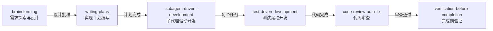
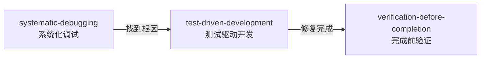

# Skills 索引

> **AI 必读**：本文件是 `skills/` 目录下所有 Skill 文件的索引。AI 在需要使用 Skill 时，应**首先查阅本索引**，根据任务需求匹配合适的 Skill，而非逐一扫描目录。

## 索引元信息

- **索引版本**：2.0.0
- **最后更新**：2026-04-16
- **Skill 总数**：15
- **索引维护方式**：AI 自动维护（见底部维护指令）

---

## 快速导航

| Skill 名称 | 文件路径 | 简要描述 | 关键词 |
|------------|---------|----------|--------|
| 项目总结 | [project-summary.md](./tools/project-summary.md) | 高质量项目经历生成（含写作方法论+避坑清单+岗位适配） | `简历`, `项目总结`, `量化指标`, `差异化`, `岗位适配` |
| Git 多环境隔离 | [git-multi-env.md](./tools/git-multi-env.md) | Git SSH Key 多环境隔离（基于远程 URL 自动匹配身份，项目可混放同一目录） | `git`, `ssh`, `多账号`, `环境隔离`, `gitconfig`, `hasconfig` |
| Awesome Design | [awesome-design.md](./tools/awesome-design.md) | 从 awesome-design-md 仓库获取知名品牌设计系统，生成 DESIGN.md 文件 | `DESIGN.md`, `设计系统`, `UI`, `设计模板`, `品牌设计` |
| 提示词自动优化器 | [prompt-optimizer.md](./meta/prompt-optimizer.md) | 自动拦截用户与 AI 的对话，优化提示词结构和表达，提升 AI 响应质量 | `提示词优化`, `prompt engineering`, `对话拦截`, `AI 交互`, `自动化` |
| AI 不足捕捉与规则生成器 | [ai-rule-generator.md](./meta/ai-rule-generator.md) | 自动捕捉 AI 的不足之处，分析根因并生成规则文件，持续提升协作质量 | `规则生成`, `AI 改进`, `质量提升`, `自动化`, `规范管理`, `持续优化` |
| Skill 自动激活守护器 | [skill-auto-activator.md](./meta/skill-auto-activator.md) | 一键冷启动（`#start`）：加载所有规则 + 激活所有自动化 Skill，确保 AI 从新对话第一条消息起就处于最佳工作状态 | `Skill 管理`, `自动激活`, `守护进程`, `状态监控`, `编排`, `规则加载`, `一键启动`, `冷启动` |
| 代码自动审查与修复器 | [code-review-auto-fix.md](./tools/code-review-auto-fix.md) | 自动审查 AI 生成的代码，基于 rules/ 规范 + 通用软件工程最佳实践双层体系全方位检查，发现问题自动修复直到合规 | `代码审查`, `自动修复`, `代码质量`, `规范检查`, `code review`, `SOLID`, `最佳实践` |
| Skill 质量守护者 | [skill-quality-guardian.md](./meta/skill-quality-guardian.md) | 自动学习最新 AI 知识，基于前沿最佳实践审查和完善所有 Skill，确保 Skill 体系始终高质量 | `Skill 质量`, `自动完善`, `AI 知识学习`, `持续改进`, `质量保障`, `最佳实践` |
| Skill 创建器 | [skill-creator.md](./meta/skill-creator.md) | 标准化 Skill 创建流程，快速生成结构规范、可分发的 Skill 包 | `Skill 创建`, `脚手架`, `标准化`, `打包`, `SKILL.md` |
| 需求探索与设计 | [brainstorming/SKILL.md](./workflow/brainstorming/SKILL.md) | 在任何创造性工作之前，通过协作对话探索用户意图、需求和设计方案 | `需求分析`, `设计`, `brainstorming`, `方案探索`, `工作流` |
| 实现计划编写 | [writing-plans/SKILL.md](./workflow/writing-plans/SKILL.md) | 将设计方案拆分为详细的、可执行的实现计划，每个任务 2-5 分钟粒度 | `实现计划`, `任务拆分`, `TDD`, `工作流` |
| 测试驱动开发 | [test-driven-development/SKILL.md](./workflow/test-driven-development/SKILL.md) | 强制 RED-GREEN-REFACTOR 循环，先写失败测试再写最小实现 | `TDD`, `测试驱动`, `RED-GREEN-REFACTOR`, `单元测试` |
| 系统化调试 | [systematic-debugging/SKILL.md](./workflow/systematic-debugging/SKILL.md) | 四阶段根因分析流程：先找根因再修复 | `调试`, `debugging`, `根因分析`, `Bug 修复` |
| 完成前验证 | [verification-before-completion/SKILL.md](./workflow/verification-before-completion/SKILL.md) | 在声称工作完成之前，必须运行验证命令并确认输出 | `验证`, `完成检查`, `质量保障`, `证据驱动` |
| 子代理驱动开发 | [subagent-driven-development/SKILL.md](./workflow/subagent-driven-development/SKILL.md) | 每个任务分派全新子代理，配合两阶段审查实现高质量快速迭代 | `子代理`, `subagent`, `并行开发`, `任务分派` |

---

## 🔗 工作流编排

> **AI 必读**：以下工作流 Skill 之间存在明确的调用链关系。当触发工作流时，AI 必须按链路顺序执行，不得跳过任何环节。

### 完整开发工作流



### Bug 修复工作流



### 工作流触发规则

| 用户意图 | 触发的工作流 | 起始 Skill |
|---------|------------|------------|
| 新功能/新项目 | 完整开发工作流 | brainstorming |
| Bug 修复 | Bug 修复工作流 | systematic-debugging |
| 简单代码修改 | 无需工作流 | 直接执行（遵守 rules） |
| 重构 | 完整开发工作流（简化版） | brainstorming |

---

## 详细索引

### 📋 project-summary

- **文件**：[project-summary.md](./tools/project-summary.md)
- **功能**：高质量项目经历生成，内置写作方法论、差异化策略、避坑清单和岗位适配策略
- **适用场景**：为简历准备项目经历描述、针对不同岗位级别调整内容侧重、量化项目成果
- **输入**：一个可分析的项目代码库（建议同时提供目标岗位级别）
- **输出**：精炼的简历项目经历文本（10-15行）

### 📋 git-multi-env

- **文件**：[git-multi-env.md](./tools/git-multi-env.md)
- **功能**：Git SSH Key 多环境隔离配置，基于远程仓库 URL 自动匹配用户身份，项目可混放同一目录
- **适用场景**：一台机器管理多个 Git 平台账号、同一平台多账号、快速生成 SSH Key
- **输入**：用户提供域名、用户名、邮箱
- **输出**：自动执行密钥生成 + SSH config + gitconfig 配置 + 输出公钥

### 📋 awesome-design

- **文件**：[awesome-design.md](./tools/awesome-design.md)
- **功能**：从 awesome-design-md 仓库获取 60+ 知名品牌的设计系统（DESIGN.md），包括 Vercel、Stripe、Claude、Linear 等，快速为项目引入专业设计系统
- **适用场景**：为新项目选择设计风格、快速生成 UI 设计系统、让 AI 代理根据品牌风格生成一致的 UI
- **输入**：用户选择品牌名称（如 vercel、stripe、claude 等）
- **输出**：在项目根目录生成对应的 DESIGN.md 文件

### 📋 prompt-optimizer

- **文件**：[prompt-optimizer.md](./meta/prompt-optimizer.md)
- **功能**：自动拦截用户与 AI 的对话，运用提示词工程最佳实践优化提示词结构和表达，然后自动发送给 AI 执行，提升响应质量
- **适用场景**：日常 AI 对话中自动提升提示词质量、不熟悉提示词工程的用户获得更好的 AI 响应、复杂任务的提示词结构化
- **输入**：用户的原始提示词/对话内容
- **输出**：优化后的提示词（自动替换原始输入发送给 AI）

### 📋 ai-rule-generator

- **文件**：[ai-rule-generator.md](./meta/ai-rule-generator.md)
- **功能**：自动捕捉 AI 在对话和编码中的不足之处（如代码风格错误、边界条件遗漏、规范违反等），分析根因并自动生成对应的规则条目写入规则文件，形成自我进化的规则体系
- **适用场景**：AI 协作过程中自动积累规范、将用户的纠正和反馈转化为持久化规则、持续提升 AI 代码生成质量
- **输入**：AI 与用户的对话过程、用户的反馈和纠正信号
- **输出**：新增或更新的规则文件 + 更新后的规则索引 + 不足分析报告

### 📋 skill-auto-activator

- **文件**：[skill-auto-activator.md](./meta/skill-auto-activator.md)
- **功能**：作为整个 AI 协作体系的启动引擎 + 守护进程，提供 `#start` 一键冷启动指令，在每次全新对话中完成「加载规则 → 激活 Skill → 输出状态报告」的完整启动序列，确保 AI 从第一条消息起就处于规则约束 + Skill 增强的最佳工作状态
- **适用场景**：每次新对话一键冷启动（`#start`）、加载所有规则并激活所有自动化 Skill、持续监控 Skill 运行健康状态和规则遵守情况、新增自动化 Skill 时自动发现并热激活
- **输入**：skills/index.md 索引文件、rules/index.md 索引文件和各 Skill/Rule 文件内容
- **输出**：冷启动报告（规则加载 + Skill 激活）+ 健康检查报告

### 📋 code-review-auto-fix

- **文件**：[code-review-auto-fix.md](./tools/code-review-auto-fix.md)
- **功能**：作为 AI 代码生成流程的全方位质量门禁，采用双层审查体系：第一层基于 rules/ 目录下所有项目规范（动态加载），第二层基于通用软件工程最佳实践（内置标准，含 SOLID 原则、设计模式、可测试性、并发安全、健壮性容错、安全纵深、性能深度、API 契约兼容性、配置管理、日志可观测性、代码整洁度等 12 个维度），发现不合规项自动修复，循环审查直到完全合规
- **适用场景**：AI 生成代码后自动质量把关、确保代码符合所有开发规范、自动修复常见代码质量问题
- **输入**：AI 本轮生成或修改的代码内容
- **输出**：审查通过的高质量代码 + 审查报告（含修复记录）

### 📋 skill-quality-guardian

- **文件**：[skill-quality-guardian.md](./meta/skill-quality-guardian.md)
- **功能**：作为整个 Skill 体系的质量守护者，持续学习最新的 AI 领域知识（Prompt Engineering、Agent 设计模式、LLM 最佳实践等），基于前沿知识对所有 Skill 进行 9 维度质量审查（结构完整性、指令有效性、执行流程合理性、知识前沿性、人机交互设计、鲁棒性与容错、可维护性与可扩展性、协作兼容性、示例充分性），自动发现不足并完善，确保每个 Skill 都是高质量的、与时俱进的
- **适用场景**：新 Skill 创建后自动质量审查、定期对所有 Skill 进行全量审查、基于最新 AI 知识升级已有 Skill、查看 Skill 质量评分排行
- **输入**：Skill 文件内容、AI 领域最新知识、用户反馈
- **输出**：经过质量审查和完善后的高质量 Skill 文件 + 质量审查报告 + 知识更新清单

### 📋 skill-creator

- **文件**：[skill-creator.md](./meta/skill-creator.md)
- **功能**：标准化 Skill 创建流程，快速生成结构规范、可分发的 Skill 包（.zip 或 .skill 文件），包含完整的 SKILL.md 元数据和目录结构
- **适用场景**：创建新的可分发 Skill、将已有功能打包为标准 Skill 包、快速生成 Skill 脚手架
- **输入**：技能的功能描述和基本信息
- **输出**：打包后的 .zip 或 .skill 文件，包含 SKILL.md 和附属文件

### 🔄 brainstorming

- **文件**：[brainstorming/SKILL.md](./workflow/brainstorming/SKILL.md)
- **类型**：🔗 工作流 Skill
- **功能**：在任何创造性工作之前，通过协作对话探索用户意图、需求和设计方案，确保 AI 不会跳过思考直接写代码
- **适用场景**：用户提出新功能需求、描述要构建的东西、说"帮我做/写/建/创建 XXX"
- **输入**：用户的需求描述或想法
- **输出**：经过验证的设计文档
- **后续 Skill**：`writing-plans`

### 🔄 writing-plans

- **文件**：[writing-plans/SKILL.md](./workflow/writing-plans/SKILL.md)
- **类型**：🔗 工作流 Skill
- **功能**：将设计方案拆分为详细的、可执行的实现计划，每个任务细化到 2-5 分钟粒度，确保任何工程师（包括 AI 子代理）都能无歧义地执行
- **适用场景**：brainstorming 完成设计并获得用户批准后、用户提供了明确的需求规格
- **输入**：经过验证的设计文档或需求规格
- **输出**：详细的实现计划文档
- **后续 Skill**：`subagent-driven-development` 或 `test-driven-development`

### 🔄 test-driven-development

- **文件**：[test-driven-development/SKILL.md](./workflow/test-driven-development/SKILL.md)
- **类型**：🔗 工作流 Skill
- **功能**：强制执行 RED-GREEN-REFACTOR 循环：先写失败测试，再写最小实现，最后重构。违反此流程的代码必须删除重来
- **适用场景**：实现任何新功能、修复任何 Bug、重构代码、修改行为
- **输入**：要实现的功能需求或要修复的 Bug 描述
- **输出**：经过 TDD 流程验证的高质量代码
- **附属文件**：`testing-anti-patterns.md`（测试反模式参考）

### 🔄 systematic-debugging

- **文件**：[systematic-debugging/SKILL.md](./workflow/systematic-debugging/SKILL.md)
- **类型**：🔗 工作流 Skill
- **功能**：四阶段根因分析流程（根因调查 → 模式分析 → 假设测试 → 实现修复），先找根因再修复，随机修复浪费时间并制造新 Bug
- **适用场景**：遇到任何 Bug、测试失败、意外行为、性能问题、构建失败
- **输入**：Bug 描述、错误信息或意外行为
- **输出**：根因分析报告 + 经过验证的修复

### 🔄 verification-before-completion

- **文件**：[verification-before-completion/SKILL.md](./workflow/verification-before-completion/SKILL.md)
- **类型**：🔗 工作流 Skill
- **功能**：在声称工作完成之前，必须运行验证命令并确认输出。证据先于断言，永远如此
- **适用场景**：即将声称工作完成、即将提交代码、即将创建 PR、即将声称 Bug 已修复
- **输入**：要验证的工作内容
- **输出**：验证结果报告

### 🔄 subagent-driven-development

- **文件**：[subagent-driven-development/SKILL.md](./workflow/subagent-driven-development/SKILL.md)
- **类型**：🔗 工作流 Skill
- **功能**：通过分派全新子代理执行计划中的每个任务，配合两阶段审查（规格合规 + 代码质量），实现高质量快速迭代
- **适用场景**：writing-plans 完成计划编写后、用户选择子代理驱动执行
- **输入**：实现计划文档
- **输出**：经过两阶段审查的高质量实现代码
- **附属文件**：`implementer-prompt.md`、`spec-reviewer-prompt.md`、`code-quality-reviewer-prompt.md`

---

## AI 使用指南

### 🔍 如何匹配 Skill

1. **工作流优先**：如果用户的需求匹配工作流触发规则（见上方「工作流编排」章节），**必须**按工作流链路执行
2. **关键词匹配**：根据用户需求中的关键词，在上方「快速导航」表格的「关键词」列中查找匹配项
3. **场景匹配**：在「详细索引」中查看每个 Skill 的「适用场景」，选择最符合当前任务的 Skill
4. **组合使用**：如果任务涉及多个方面，可以组合使用多个 Skill

### 📖 使用流程

```
1. 查阅本索引 → 检查是否触发工作流
2. 如果触发工作流 → 按工作流链路依次执行各 Skill
3. 如果未触发工作流 → 匹配合适的独立 Skill
4. 读取对应 Skill 文件 → 了解执行步骤和输出模板
5. 按照 Skill 定义的流程执行任务
6. 按照 Skill 定义的模板输出结果
```

### 📁 Skill 文件结构说明

Skill 按三层分类存放：

1. **元能力层**：`skills/meta/` — 让 AI 自我进化的能力（如规则生成、Skill 质量守护）
2. **工作流层**：`skills/workflow/` — 开发流程纪律（如 brainstorming、TDD）
3. **工具层**：`skills/tools/` — 实用工具（如代码审查、项目总结）

每个 Skill 支持两种文件结构：

1. **单文件 Skill**：`skills/<层>/xxx.md` — 适用于简单 Skill
2. **目录 Skill**：`skills/<层>/xxx/SKILL.md` + 附属文件 — 适用于复杂 Skill，可包含子 prompt、脚本、示例等

---

## 🔧 索引自动维护指令

> **强制要求**：AI 在对 `skills/` 目录进行文件增删改时，**必须同步更新本索引**。

- **新增 Skill**：在「快速导航」添加行 + 在「详细索引」添加详情块（参照已有条目格式） + 更新元信息的总数和日期
- **删除 Skill**：从「快速导航」和「详细索引」中移除对应条目 + 更新元信息的总数和日期
- **修改 Skill**：更新「快速导航」和「详细索引」中受影响的字段 + 更新对应条目和元信息的日期
- 变更历史由 git log 追踪，索引中不再单独记录
