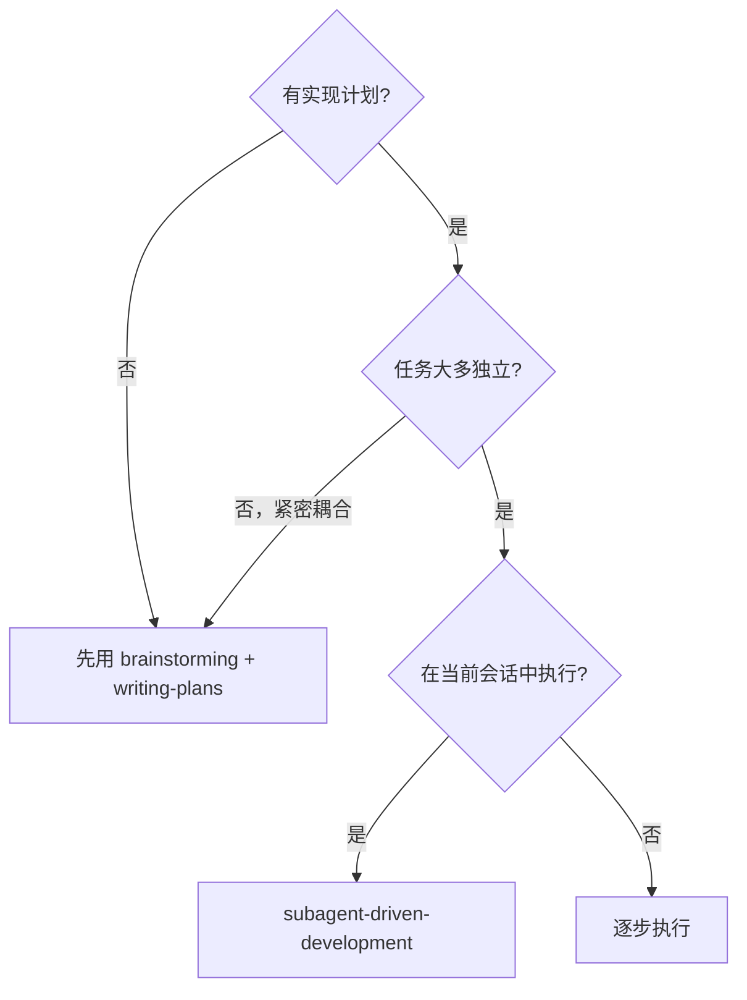
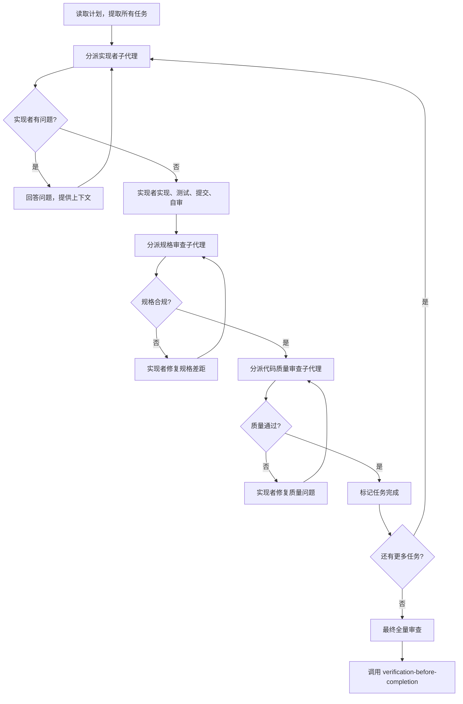

# 子代理驱动开发

## 功能说明

> **核心目标**：通过分派全新子代理执行计划中的每个任务，配合两阶段审查（规格合规审查 + 代码质量审查），实现高质量快速迭代。

**为什么用子代理：** 你将任务委派给具有隔离上下文的专门代理。通过精确构建它们的指令和上下文，确保它们保持专注并成功完成任务。它们不应继承你的会话上下文或历史——你构建它们需要的一切。这也为你自己保留了协调工作的上下文。

**核心原则：** 每个任务一个全新子代理 + 两阶段审查（规格 → 质量）= 高质量、快速迭代

---

## 适用场景



---

## 执行流程



---

## 处理实现者状态

实现者子代理报告四种状态之一：

| 状态 | 处理方式 |
|------|---------|
| **DONE** | 进入规格合规审查 |
| **DONE_WITH_CONCERNS** | 阅读关注点。如果关于正确性或范围，先处理再审查。如果是观察（如"文件变大了"），记录并继续审查 |
| **NEEDS_CONTEXT** | 提供缺失的上下文并重新分派 |
| **BLOCKED** | 评估阻塞原因：1) 上下文问题→提供更多上下文 2) 需要更强推理→用更强模型 3) 任务太大→拆分 4) 计划本身有问题→上报用户 |

**永远不要**忽略上报或强迫同一模型在没有变化的情况下重试。

---

## Prompt 模板

### 实现者子代理 Prompt

参见附属文件：[implementer-prompt.md](./implementer-prompt.md)

### 规格合规审查子代理 Prompt

参见附属文件：[spec-reviewer-prompt.md](./spec-reviewer-prompt.md)

### 代码质量审查子代理 Prompt

参见附属文件：[code-quality-reviewer-prompt.md](./code-quality-reviewer-prompt.md)

---

## 模型选择策略

使用能处理每个角色的最低成本模型，以节省成本并提高速度。

| 任务类型 | 推荐模型 | 信号 |
|---------|---------|------|
| 机械实现任务 | 快速、便宜的模型 | 涉及 1-2 个文件，有完整规格 |
| 集成和判断任务 | 标准模型 | 涉及多文件，有集成关注 |
| 架构、设计和审查任务 | 最强模型 | 需要设计判断或广泛的代码库理解 |

---

## 示例工作流

```
你：我使用子代理驱动开发来执行此计划。

[读取计划文件：docs/plans/feature-plan.md]
[提取所有 5 个任务的完整文本和上下文]

任务 1：用户认证模块

[分派实现者子代理，附带完整任务文本 + 上下文]

实现者："开始之前——认证应该用 JWT 还是 Session？"

你："使用 JWT，存储在 HttpOnly Cookie 中。"

实现者："明白。开始实现..."
[稍后] 实现者：
  - 实现了 JWT 认证模块
  - 添加了测试，5/5 通过
  - 自审：发现遗漏了 token 刷新，已补充
  - 已提交

[分派规格合规审查子代理]
规格审查：✅ 规格合规 - 所有需求满足，无多余内容

[分派代码质量审查子代理]
代码审查：优点：测试覆盖好，代码干净。问题：无。通过。

[标记任务 1 完成]

任务 2：用户注册接口
...

[所有任务完成后]
[分派最终全量审查子代理]
最终审查：所有需求满足，准备合并

完成！
```

---

## 危险信号

**永远不要：**
- 跳过审查（规格合规或代码质量）
- 在未修复的问题下继续
- 并行分派多个实现子代理（会冲突）
- 让子代理自己读计划文件（提供完整文本）
- 忽略子代理的问题（回答后再让它们继续）
- 接受"差不多"的规格合规（审查发现问题 = 未完成）
- 跳过审查循环（审查发现问题 = 实现者修复 = 重新审查）
- **在规格合规通过之前开始代码质量审查**（顺序错误）
- 在任一审查有未解决问题时移动到下一个任务

---

## 优势

| 对比 | 优势 |
|------|------|
| vs 手动执行 | 子代理自然遵循 TDD；每个任务全新上下文；并行安全 |
| vs 逐步执行 | 同一会话；持续进展；审查检查点自动化 |
| 质量门禁 | 自审 + 两阶段审查 + 审查循环确保修复有效 |
| 成本 | 更多子代理调用，但早期发现问题（比后期调试便宜） |

---

## 与其他 Skill 的关系

| 关系 | Skill | 说明 |
|------|-------|------|
| **前置** | `writing-plans` | 创建此 Skill 执行的计划 |
| **协作** | `test-driven-development` | 子代理执行任务时遵循 TDD |
| **协作** | `code-review-auto-fix` | 代码质量审查的参考 |
| **后续** | `verification-before-completion` | 所有任务完成后最终验证 |
