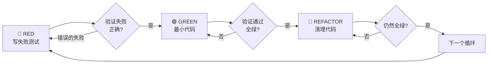

# 测试驱动开发（TDD）

## 功能说明

> **核心目标**：先写测试，看它失败，再写最小代码使其通过。**如果你没有看到测试失败，你就不知道它是否测试了正确的东西。**

**违反规则的字面意思就是违反规则的精神。**

---

## 铁律

```
没有失败的测试 → 不写生产代码
```

先写了代码再写测试？**删除代码。从头开始。**

**没有例外：**
- 不要把它留作"参考"
- 不要在写测试时"改编"它
- 不要看它
- 删除就是删除

从测试出发，全新实现。句号。

---

## 适用场景

**始终使用：**
- 新功能
- Bug 修复
- 重构
- 行为变更

**例外（需用户确认）：**
- 一次性原型
- 生成的代码
- 配置文件

想着"就这一次跳过 TDD"？停下。那是自我合理化。

---

## RED-GREEN-REFACTOR 循环



### 🔴 RED — 写失败测试

写一个最小的测试，展示期望的行为。

<Good>

```go
func TestRetryFailedOperations3Times(t *testing.T) {
    attempts := 0
    operation := func() (string, error) {
        attempts++
        if attempts < 3 {
            return "", errors.New("fail")
        }
        return "success", nil
    }

    result, err := RetryOperation(operation)

    assert.NoError(t, err)
    assert.Equal(t, "success", result)
    assert.Equal(t, 3, attempts)
}
```
清晰的名称，测试真实行为，只测一件事

</Good>

<Bad>

```go
func TestRetryWorks(t *testing.T) {
    mock := new(MockOperation)
    mock.On("Execute").Return("", errors.New("")).Times(2)
    mock.On("Execute").Return("success", nil).Once()
    RetryOperation(mock.Execute)
    mock.AssertNumberOfCalls(t, "Execute", 3)
}
```
模糊的名称，测试 mock 而非代码

</Bad>

**要求：**
- 一个行为
- 清晰的名称
- 真实代码（除非不可避免才用 mock）

### 验证 RED — 看它失败

**强制。永远不要跳过。**

```bash
go test ./path/to/... -run TestName -v
```

确认：
- 测试失败（不是报错）
- 失败信息符合预期
- 因为功能缺失而失败（不是拼写错误）

**测试通过了？** 你在测试已有行为。修改测试。

**测试报错了？** 修复错误，重新运行直到它正确失败。

### 🟢 GREEN — 最小代码

写最简单的代码使测试通过。

<Good>

```go
func RetryOperation[T any](fn func() (T, error)) (T, error) {
    var zero T
    for i := 0; i < 3; i++ {
        result, err := fn()
        if err == nil {
            return result, nil
        }
        if i == 2 {
            return zero, err
        }
    }
    return zero, errors.New("unreachable")
}
```
刚好够通过测试

</Good>

<Bad>

```go
func RetryOperation[T any](
    fn func() (T, error),
    opts ...RetryOption,  // YAGNI
) (T, error) {
    config := defaultConfig()
    for _, opt := range opts {
        opt(config)  // 过度工程化
    }
    // ...
}
```
过度工程化

</Bad>

不要添加功能、重构其他代码、或"改进"超出测试范围的东西。

### 验证 GREEN — 看它通过

**强制。**

```bash
go test ./path/to/... -run TestName -v
```

确认：
- 测试通过
- 其他测试仍然通过
- 输出干净（无错误、无警告）

**测试失败？** 修改代码，不是测试。

**其他测试失败？** 立即修复。

### 🔵 REFACTOR — 清理代码

仅在 GREEN 之后：
- 消除重复
- 改善命名
- 提取辅助函数

保持测试全绿。不要添加行为。

### 重复

下一个失败测试，下一个功能。

---

## 好测试的标准

| 质量 | 好 | 坏 |
|------|---|---|
| **最小** | 只测一件事。名称中有"和"？拆分它 | `TestValidatesEmailAndDomainAndWhitespace` |
| **清晰** | 名称描述行为 | `TestTest1` |
| **展示意图** | 展示期望的 API | 隐藏代码应该做什么 |

---

## 为什么顺序很重要

### "我先写代码，后面补测试验证"

后写的测试立即通过。立即通过什么都证明不了：
- 可能测错了东西
- 可能测的是实现而非行为
- 可能遗漏了你忘记的边界情况
- 你从未看到它捕获 bug

先写测试迫使你看到测试失败，证明它确实在测试某些东西。

### "我已经手动测试了所有边界情况"

手动测试是临时的。你以为测了所有情况，但：
- 没有记录测了什么
- 代码变更后无法重新运行
- 压力下容易遗漏
- "我试过了它能工作" ≠ 全面测试

自动化测试是系统化的。每次运行方式相同。

### "删除 X 小时的工作太浪费了"

沉没成本谬误。时间已经过去了。你现在的选择：
- 删除并用 TDD 重写（X 小时，高信心）
- 保留并后补测试（30 分钟，低信心，可能有 bug）

"浪费"是保留你无法信任的代码。没有真正测试的工作代码是技术债。

### "TDD 太教条了，务实意味着灵活"

TDD **就是**务实的：
- 在提交前发现 bug（比后期调试更快）
- 防止回归（测试立即捕获破坏）
- 文档化行为（测试展示如何使用代码）
- 支持重构（自由修改，测试捕获破坏）

"务实"的捷径 = 在生产环境调试 = 更慢。

---

## 常见借口反驳表

| 借口 | 现实 |
|------|------|
| "太简单不需要测试" | 简单代码也会坏。测试只需 30 秒 |
| "我后面补测试" | 后补的测试立即通过，什么都证明不了 |
| "后补测试达到同样目的" | 后补测试 = "这做了什么？" 先写测试 = "这应该做什么？" |
| "已经手动测试了" | 临时 ≠ 系统化。没有记录，无法重新运行 |
| "删除 X 小时的工作太浪费" | 沉没成本谬误。保留未验证代码是技术债 |
| "留作参考，先写测试" | 你会改编它。那就是后补测试。删除就是删除 |
| "需要先探索" | 可以。扔掉探索结果，用 TDD 重新开始 |
| "测试难写 = 设计不清楚" | 听测试的话。难测试 = 难使用 |
| "TDD 会拖慢我" | TDD 比调试更快。务实 = 先写测试 |
| "手动测试更快" | 手动测试不能证明边界情况。每次变更都要重新测 |
| "现有代码没有测试" | 你在改进它。为现有代码添加测试 |

---

## 危险信号 — 立即停下并重新开始

- 先写了代码再写测试
- 实现完成后才补测试
- 测试立即通过
- 无法解释为什么测试失败了
- 测试"后面再加"
- 自我合理化"就这一次"
- "我已经手动测试了"
- "后补测试达到同样目的"
- "重要的是精神不是形式"
- "留作参考"或"改编现有代码"
- "已经花了 X 小时，删除太浪费"
- "TDD 太教条了，我在务实"
- "这次不一样因为..."

**以上所有都意味着：删除代码。用 TDD 重新开始。**

---

## Bug 修复示例

**Bug：** 空邮箱被接受

**🔴 RED**
```go
func TestRejectsEmptyEmail(t *testing.T) {
    result, err := SubmitForm(FormData{Email: ""})
    assert.Error(t, err)
    assert.Equal(t, "邮箱不能为空", err.Error())
}
```

**验证 RED**
```bash
$ go test ./...
FAIL: expected error "邮箱不能为空", got nil
```

**🟢 GREEN**
```go
func SubmitForm(data FormData) (*Result, error) {
    if strings.TrimSpace(data.Email) == "" {
        return nil, errors.New("邮箱不能为空")
    }
    // ...
}
```

**验证 GREEN**
```bash
$ go test ./...
PASS
```

**🔵 REFACTOR**
如果需要，提取验证函数用于多个字段。

---

## 验证清单

标记工作完成之前：

- [ ] 每个新函数/方法都有测试
- [ ] 在实现之前看到每个测试失败
- [ ] 每个测试因预期原因失败（功能缺失，不是拼写错误）
- [ ] 写了最小代码使每个测试通过
- [ ] 所有测试通过
- [ ] 输出干净（无错误、无警告）
- [ ] 测试使用真实代码（仅在不可避免时使用 mock）
- [ ] 边界情况和错误场景已覆盖

无法勾选所有项？你跳过了 TDD。重新开始。

---

## 卡住时怎么办

| 问题 | 解决方案 |
|------|---------|
| 不知道怎么测试 | 写出你期望的 API。先写断言。问用户 |
| 测试太复杂 | 设计太复杂。简化接口 |
| 必须 mock 所有东西 | 代码耦合太紧。使用依赖注入 |
| 测试设置太庞大 | 提取辅助函数。仍然复杂？简化设计 |

---

## 调试集成

发现 Bug？写一个重现它的失败测试。遵循 TDD 循环。测试证明修复有效并防止回归。

永远不要在没有测试的情况下修复 Bug。

---

## 最终规则

```
生产代码 → 必须有对应的测试，且测试先失败过
否则 → 不是 TDD
```

没有用户许可，不得例外。

---

## 与其他 Skill 的关系

| 关系 | Skill | 说明 |
|------|-------|------|
| **前置** | `writing-plans` | 计划中的每个任务都应遵循 TDD |
| **协作** | `subagent-driven-development` | 子代理执行任务时遵循 TDD |
| **后续** | `verification-before-completion` | TDD 完成后进行最终验证 |
| **协作** | `systematic-debugging` | Bug 修复时先写失败测试 |
| **协作** | `code-review-auto-fix` | 审查代码是否遵循了 TDD |
